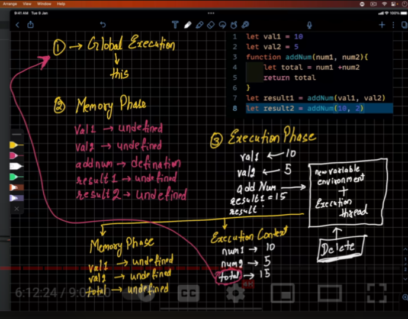
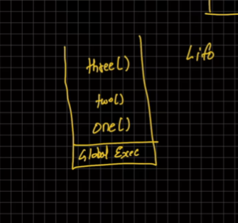

# javaScript Basics  for learning purpose

## How does javascript work 
-> javascript execution context
1. Global execution context
2. Functional execution context.
3. Eval execution context(temporary)

## javascript code runs in two phase
1. Memory __creation phase__.(first cycle)(create variable(empty))
2. Execution Phase.(update on variables of js code)

## Call Stack

### javascript is single threaded